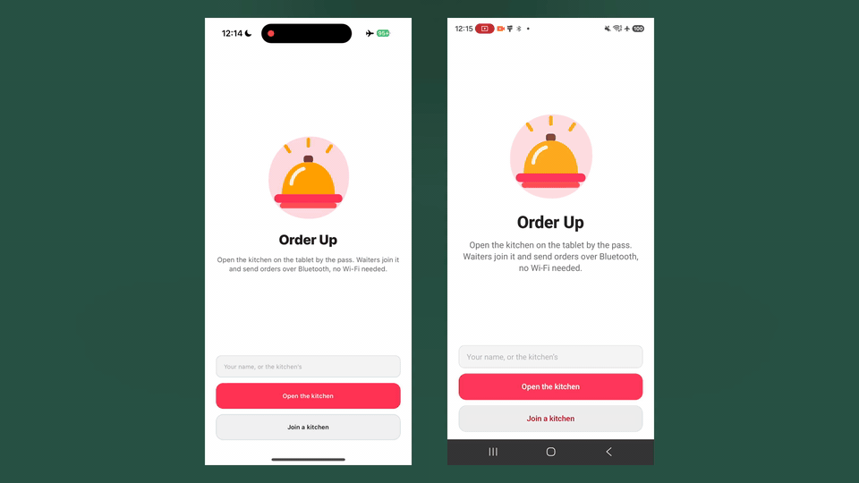
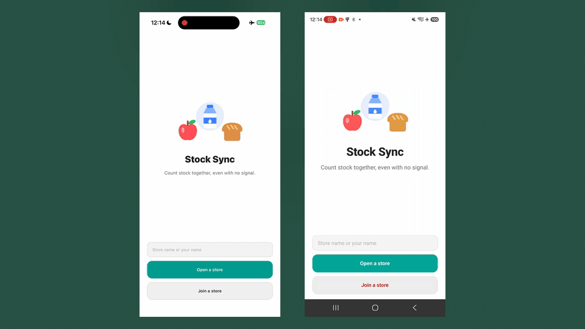
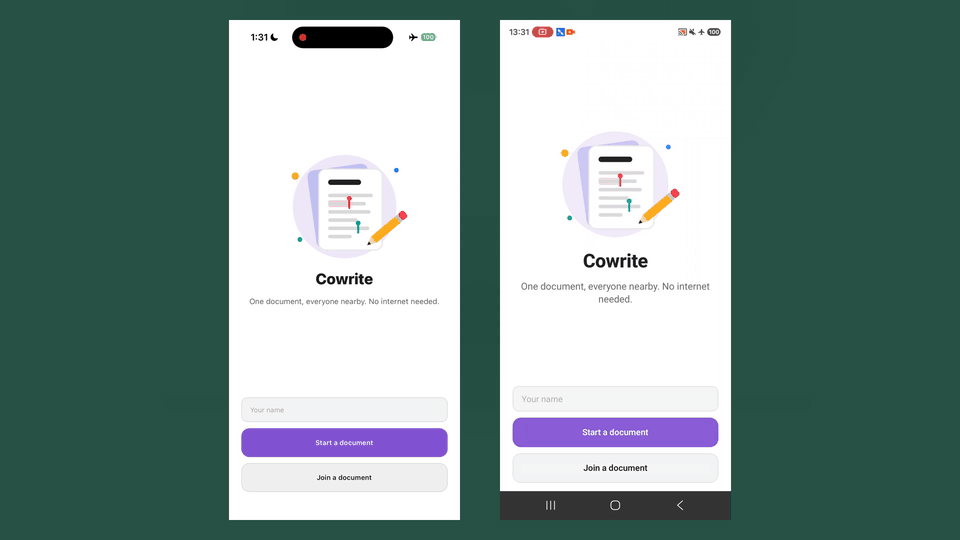

# Offline Protocol — example apps

pnpm + [Turborepo](https://turbo.build/) monorepo for sample apps that use the [@offline-protocol/mesh-sdk](https://www.npmjs.com/package/@offline-protocol/mesh-sdk).

## Layout

```
apps/           Example applications (one folder per app)
packages/       Shared libraries (optional, for code reused across apps)
```

## Requirements

- Node.js 20+
- [pnpm](https://pnpm.io/) 11+ (see `packageManager` in root `package.json`)

## Commands

From the repo root:

```sh
pnpm install
pnpm dev          # start dev servers for all apps (where defined)
pnpm build        # typecheck / build all packages
pnpm lint
pnpm test
```

Run a single app with a filter:

```sh
pnpm --filter @offline-app-examples/tictactogether dev
pnpm --filter @offline-app-examples/tictactogether ios
pnpm --filter @offline-app-examples/tictactogether android
```

## Apps

| App | Path | Description |
| --- | --- | --- |
| Tic Tac Together | [`apps/tictactogether`](./apps/tictactogether) | Two-player tic-tac-toe over nearby Bluetooth |
| Stock Sync | [`apps/stocksync`](./apps/stocksync) | Shared supermarket inventory; quantities sync across nearby devices |
| Order Up | [`apps/orderup`](./apps/orderup) | Restaurant POS: order devices send tickets to a kitchen display, status flows back |
| Cowrite | [`apps/cowrite`](./apps/cowrite) | Offline shared doc editor with live cursors, built on the SDK's CRDT documents |

### Order Up



### Stock Sync



### Cowrite



Shared code lives in [`packages/ui`](./packages/ui) (React Native Reusables components + nearby lobby) and [`packages/mesh`](./packages/mesh) (a small nearby-room wrapper over the SDK).

See each app’s README for platform setup (CocoaPods, signing, etc.).

## Adding a new example

1. Create `apps/<your-app>/` with its own `package.json` (`private: true`).
2. Use a scoped name: `@offline-app-examples/<your-app>`.
3. Wire scripts used by Turbo: at minimum `dev`, `build`, `lint`, and/or `test` as appropriate.
4. Document run instructions in `apps/<your-app>/README.md`.
