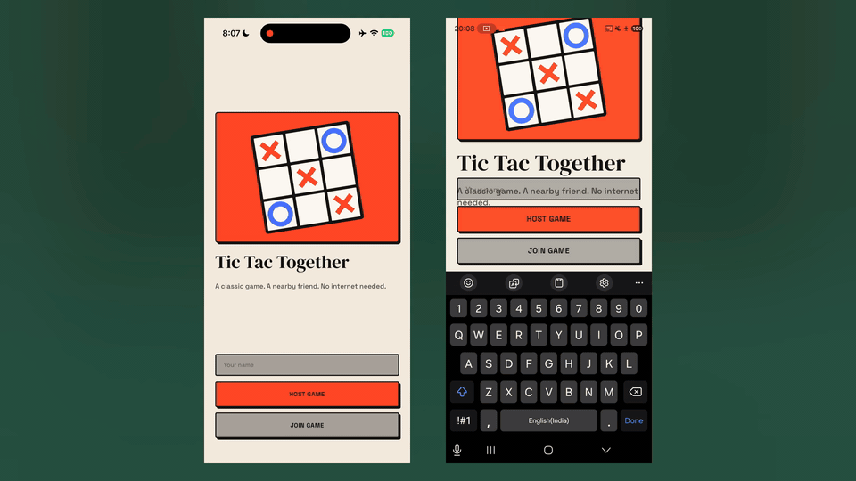
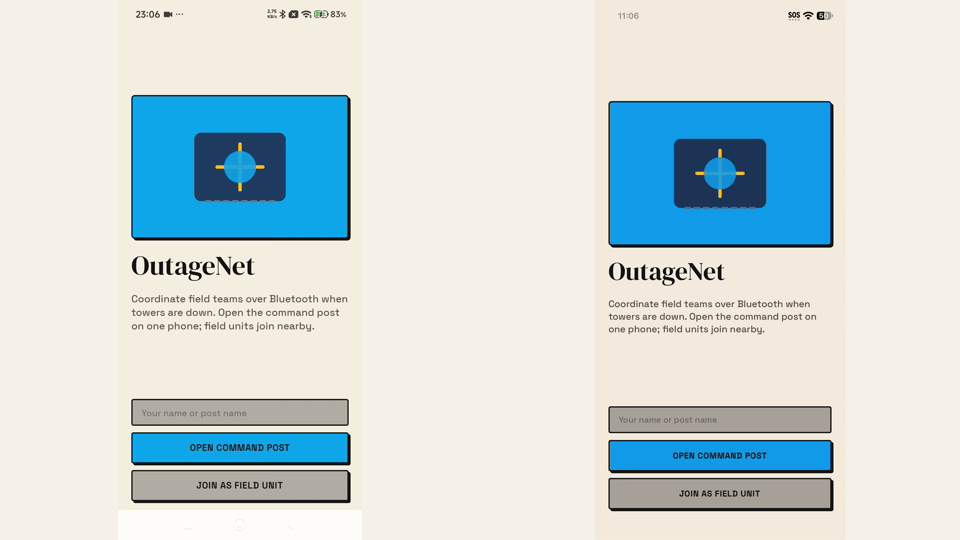
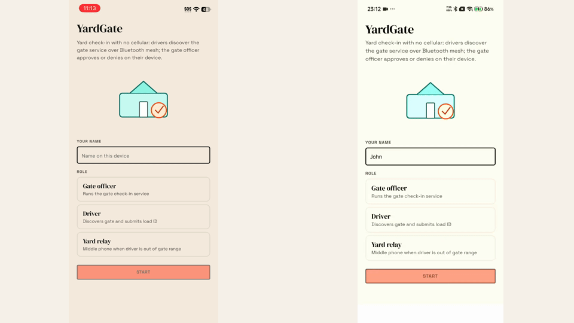
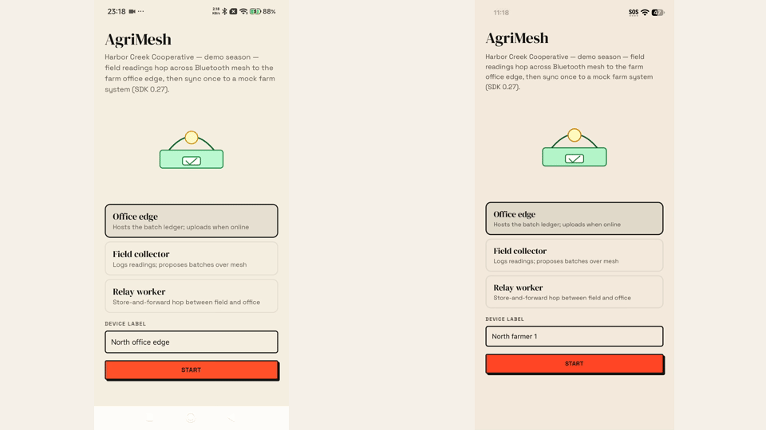

# Offline Protocol example apps

Example React Native apps for iOS and Android built on
[`@offline-protocol/mesh-sdk`](https://www.npmjs.com/package/@offline-protocol/mesh-sdk).
Each app runs between phones in the same room over Bluetooth, with no internet,
accounts or server, and shows a different way to keep shared state in sync.

- Documentation: https://www.offlineprotocol.com/docs
- React Native setup for the SDK: https://www.offlineprotocol.com/docs/mesh-sdk/installation-rn
- Developer portal: https://dev.offlineprotocol.com

## Apps

| App | Path | What it shows |
| --- | --- | --- |
| Tic Tac Together | [`apps/tictactogether`](./apps/tictactogether) | Two-player game. Host-authoritative state with revision numbers, so duplicate and stale moves are ignored. |
| Stock Sync | [`apps/stocksync`](./apps/stocksync) | Shared inventory. Optimistic local changes confirmed by host snapshots; members keep working while out of range. |
| Order Up | [`apps/orderup`](./apps/orderup) | Restaurant orders from waiters' phones to a kitchen display. Idempotent requests, resends and status updates. |
| Cowrite | [`apps/cowrite`](./apps/cowrite) | Shared plain-text document with live cursors, built on the SDK's replicated documents (`DataStore`) in an MLS group. |
| OutageNet | [`apps/outagenet`](./apps/outagenet) | Public-sector style outage coordination: status + handoff accept over Bluetooth, mock HQ sync with idempotent ingest. |
| YardGate | [`apps/yardgate`](./apps/yardgate) | Logistics yard check-in: MeshServices discover + invoke, gate officer approve/deny, optional relay hop. |
| Event Floor | [`apps/eventfloor`](./apps/eventfloor) | Live events: Flow A staff MLS dispatch + Flow B gate admission ledger and mock platform sync (`scanId` dedupe). |
| AgriMesh | [`apps/agrimesh`](./apps/agrimesh) | Agriculture: field readings store-and-forward over multi-hop Bluetooth mesh, office-edge ledger, mock farm sync (`readingId` dedupe). |

Each app's README explains how to run it, how its sync works and what its tests cover.

### Order Up


### Stock Sync


### Cowrite


### Tic Tac Together



### OutageNet



### YardGate



### AgriMesh



## Shared packages

| Package | Path | Description |
| --- | --- | --- |
| Mesh | [`packages/mesh`](./packages/mesh) | Nearby rooms over Bluetooth on the SDK: host, discover, join, messages, optional MLS group. The only package that starts the SDK. |
| UI | [`packages/ui`](./packages/ui) | Shared React Native UI: components, NativeWind theme, `NearbyLobby` screen |

## Prerequisites

- **Two or more physical phones** (iOS 15.1 or later, Android 7.0 or later) with Bluetooth on.
  Simulators and emulators run the interface but cannot discover each other.
- Node.js 22 or 24 (LTS)
- pnpm 11, via Corepack (`corepack enable`; the version is pinned in `package.json`)
- For iOS: macOS with Xcode 16.1 or newer, CocoaPods and an Apple development team
  for signing (a free personal team works for your own phones)
- For Android: Android Studio with the Android SDK and JDK 17

No API key or developer portal account is needed to run these examples. They
use only nearby Bluetooth: the SDK's internet transports and telemetry stay off.

## Run an app

From the repository root:

```sh
corepack enable
pnpm install
cd apps/stocksync/ios && pod install && cd ../../..
pnpm --filter @offline-app-examples/stocksync dev
```

In a second terminal, with a phone attached:

```sh
pnpm --filter @offline-app-examples/stocksync ios -- --device
# or
pnpm --filter @offline-app-examples/stocksync android
```

Replace `stocksync` with `tictactogether`, `orderup`, `cowrite`, `outagenet`, `yardgate`, `eventfloor`, or `agrimesh` for the other apps.

For iOS you can also open the app's `ios/*.xcworkspace` in Xcode, choose your team
under Signing & Capabilities, and run on each phone. Debug builds load JavaScript
from Metro; install a Release build to use an app away from your computer.

## Checks

```sh
pnpm typecheck
pnpm lint
pnpm test
```

CI runs these checks and builds every app for iOS (simulator) and Android on each
pull request.

## App ids

Each app passes a fixed `appId` (for example `'stocksync'`) to the SDK's
`ProtocolConfig`. On the mesh SDK this id scopes Bluetooth pairing, service
discovery and on-device storage, so every phone running the same app must use
the same value, and different apps should use different values. It is not a
secret.

These examples do not use the developer portal. When you build your own app and
add portal features (OfflineID sign-in or SDK telemetry), create an application at
[dev.offlineprotocol.com](https://dev.offlineprotocol.com) and use its
**Application ID** (`app_...`) where those APIs ask for an app id. Never put an
API key in that field or anywhere in app source code. See
[Get an API key](https://www.offlineprotocol.com/docs/getting-started/get-api-key).

## Licensing

The code in this repository is licensed under [MIT-0](./LICENSE) (MIT No
Attribution): copy it into your own project without keeping a notice. Some
included assets and adapted components keep their own licenses; see
[THIRD_PARTY_NOTICES.md](./THIRD_PARTY_NOTICES.md).

That license covers only this repository's code. The apps depend on
`@offline-protocol/mesh-sdk`, which is licensed under **AGPL-3.0-only** or a
**commercial license** from Offline Protocol, Inc. An app that embeds the SDK,
including an app built from these examples, is subject to the AGPL-3.0-only
unless you hold a commercial license. The commercial license is for apps that
cannot or do not wish to comply with the AGPL-3.0, for example a proprietary app.
See [Licensing](https://www.offlineprotocol.com/docs/operations/licensing) and
[pricing](https://www.offlineprotocol.com/pricing), or contact
legal@offlineprotocol.com.

## Contributing and security

See [CONTRIBUTING.md](./CONTRIBUTING.md) and our [code of conduct](./CODE_OF_CONDUCT.md).
Report security issues privately to security@offlineprotocol.com
([SECURITY.md](./SECURITY.md)). For help, contact support@offlineprotocol.com.
